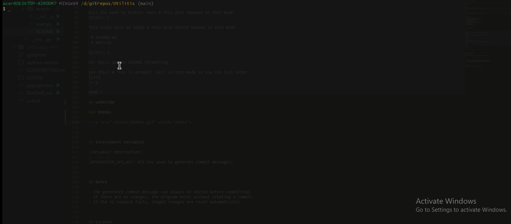

# Gitpush

"gitpush" is a small CLI utility that automates a common Git workflow.

It stages your changes, generates a commit message using AI, lets you review the message, commits the changes, and then pushes them to GitHub.

It has two options one NORMAL mode with cmd `gitpush` and YOLO mode with cmd `gitpush-y` **-y stands for YOLO** in YOLO mode it only asks to review the commit msg so when using YOLO mode Be Aware what are actually pushing!

---

## Features

- Detects whether you are inside a Git repository
- Stages all changes automatically
- Generates a commit message using AI
- Lets you review or replace the generated message
- Commits changes
- Pulls with rebase before pushing
- Pushes to the current branch

---

## Requirements

- Python 3.13+
- Git
- An OpenRouter API key

---

## Installation

**Clone the repository:**

```bash
git clone https://github.com/ssannssarr/Utilitis.git
cd Utilitis
```
**Install dependencies:**

```bash
uv sync
```
**Set your OpenRouter API key:**

```bash
export OPENROUTER_API_KEY="your-api-key"
```
---

## Usage

Run inside a Git repository:

```bash
uv run gitpush
```
or do:

run [bash.sh](./alias/bash.sh) to setup alias or [zsh.sh](./alias/zsh.sh) if you use zsh. (This will automatically setup aliases for `gitpush` and `gitpush-y` at ~/.bashrc or at ~/.zshrc )
 
**The tool will:**

1. Verify that you are inside a Git repository.
2. Show the current branch.
3. Ask for confirmation before continuing.
4. Show files that will be added.
5. Stage all changes.
6. Generate an AI commit message.
7. Let you accept or replace the message.
8. Commit the changes.
9. Pull with rebase.
10. Push to the current branch.

---

## Example Workflow


```bash
$ gitpush

Will you push to branch: main # This dont happens on YOLO mode 
(y/n)>> y

This Files will be added # This also doesnt happen in YOLO mode 

 M README.md
 M main.py

[y/n]>> y

AI: docs: update README formatting

Use this? # This is default 'yes' in YOLO mode so you can just hit enter.
[y/n]
>> y

DONE!!
```
## WORKFLOW

### NORMAL 


### YOLO 



---

## Environment Variables

|Variable| Description|
|---|---|
|OPENROUTER_API_KEY| API key used to generate commit messages|

> You can get free API key at [Openrouter](https://openrouter.ai/).I used `openai/gpt-oss-120b:free`  as default you can configure the model at [main.py](./main.py)

---

## Notes

- The generated commit message can always be edited before committing.
- If there are no changes, the program exits without creating a commit.
- If the AI request fails, staged changes are reset automatically.

---

## License

This project is part of the [Utilitis](https://github.com/ssannssarr/Utilitis) repository.
