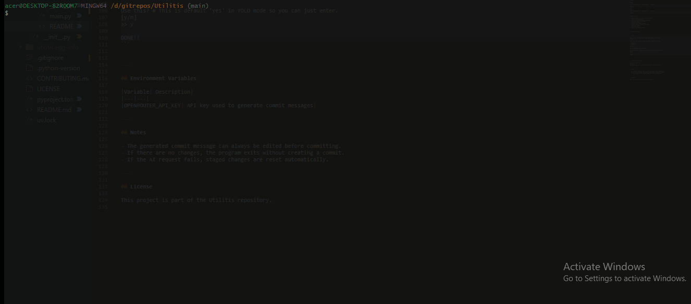

# Gitpush

"gitpush" is a small CLI utility that automates a common Git workflow.

It stages your changes, generates a commit message using AI, lets you review the message, commits the changes, and then pushes them to GitHub.

It has two options: NORMAL mode with cmd `gitpush` and YOLO mode with cmd `gitpush-y`. **-y stands for YOLO.** In YOLO mode, it only asks you to review the commit message, so when using YOLO mode be aware of what you are actually pushing!

---

## Features

- Detects whether you are inside a Git repository
- Stages all changes automatically
- Generates a commit message using AI
- Lets you review or replace the generated message
- Commits changes
- Pulls with rebase before pushing
- Pushes to the current branch

---

## Requirements

- Python 3.13+
- Git
- An OpenRouter API key

---

## Installation

```bash
curl https://raw.githubusercontent.com/ssannssarr/Utilitis/refs/heads/main/install.sh | sh 
```

It will automatically clone the repo and install the package globally. You can see the script at [install.sh](https://github.com/ssannssarr/Utilitis/blob/main/install.sh) 

---

## Example Workflow

**The tool will:**

1. Verify that you are inside a Git repository.
2. Show the current branch.
3. Ask for confirmation before continuing.
4. Show files that will be added.
5. Stage all changes.
6. Generate an AI commit message.
7. Let you accept or replace the message.
8. Commit the changes.
9. Pull with rebase.
10. Push to the current branch.


```bash
$ gitpush

Will you push to branch: main # This doesn't happen in YOLO mode 
(y/n)>> y

These files will be added # This also doesn't happen in YOLO mode 

 M README.md
 M main.py

[y/n]>> y

AI: docs: update README formatting

Use this? # This is default 'yes' in YOLO mode so you can just hit enter.
[y/n]
>> y

DONE!!
```

---

## WORKFLOW

### NORMAL 



### YOLO 


---

## Environment Variables

|Variable| Description|
|---|---|
|OPENROUTER_API_KEY| API key used to generate commit messages|

> You can get a free API key at [OpenRouter](https://openrouter.ai/). I used `openai/gpt-oss-120b:free` as the default, and you can configure the model in [main.py](./main.py)

---

## Notes

- The generated commit message can always be edited before committing.
- If there are no changes, the program exits without creating a commit.
- If the AI request fails, staged changes are reset automatically.

---

## License

This project is under GPL-3.0. See the LICENSE [here](https://github.com/ssannssarr/Utilitis/blob/main/LICENSE) 
